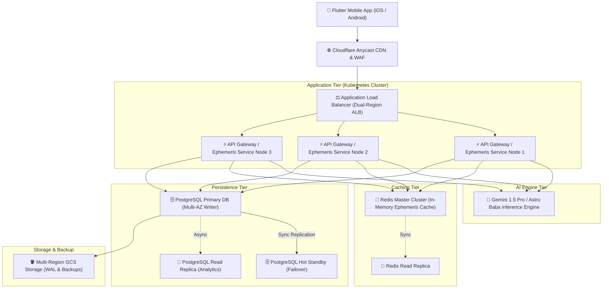

# ⚙️ TECHNICAL REQUIREMENTS DOCUMENT (TRD)

**App Name**: ASTROSAATHI  
**Technical Lead**: Lead Architect & Engineering Team  
**System Architecture**: High-Availability (HA) Microservices + Flutter Client  
**Version**: 2.5.0  
**Date**: September 3, 2026  

---

## 1. 📊 Document Overview
This document specifies the technical architecture, database schemas, API interfaces, security policies, AI integration patterns, and deployment strategies for **ASTROSAATHI**. It acts as the engineering blueprint for maintaining high performance, scalability, and zero-downtime reliability.

---

## 2. 🩻 System Architecture



---

## 3. 🛠️ Technology Stack

| Layer | Framework / Technology | Purpose & Usage |
| :--- | :--- | :--- |
| **Frontend Mobile** | Flutter 3.x / Dart 3.x | Cross-platform mobile app UI with Riverpod state management. |
| **Ephemeris Engine** | C / C++ Swiss Ephemeris (sweph) + Dart FFI | High-precision planetary degree & house cusp calculation engine. |
| **API Gateway** | Node.js / TypeScript / Go | REST & WebSocket API orchestration layer. |
| **AI LLM Engine** | Google Gemini 1.5 Pro API | Conversational AI Astrologer ("Astro Baba") & personalized interpretation. |
| **Primary Database** | PostgreSQL 16 + PostGIS | Multi-AZ relational database storing user profiles, Kundlis, and transactions. |
| **Cache Tier** | Redis 7.x Cluster | High-speed caching for daily Panchang, transits, and session tokens. |
| **Cloud Infra** | GCP (Google Cloud Platform) | GKE (Kubernetes), Cloud Run, Cloud Load Balancing & Cloud Storage. |

---

## 4. 🗄️ Database Schema (PostgreSQL)

```sql
-- User Accounts Table
CREATE TABLE users (
    id UUID PRIMARY KEY DEFAULT gen_random_uuid(),
    phone_number VARCHAR(20) UNIQUE NOT NULL,
    email VARCHAR(255) UNIQUE,
    subscription_status VARCHAR(20) DEFAULT 'FREE', -- FREE, VIP_MONTHLY, VIP_ANNUAL
    created_at TIMESTAMP WITH TIME ZONE DEFAULT CURRENT_TIMESTAMP,
    updated_at TIMESTAMP WITH TIME ZONE DEFAULT CURRENT_TIMESTAMP
);

-- Birth Profiles Table (Kundlis)
CREATE TABLE birth_profiles (
    id UUID PRIMARY KEY DEFAULT gen_random_uuid(),
    user_id UUID REFERENCES users(id) ON DELETE CASCADE,
    name VARCHAR(100) NOT NULL,
    date_of_birth DATE NOT NULL,
    time_of_birth TIME NOT NULL,
    latitude DECIMAL(9, 6) NOT NULL,
    longitude DECIMAL(9, 6) NOT NULL,
    city_name VARCHAR(100) NOT NULL,
    country_name VARCHAR(100) NOT NULL,
    timezone VARCHAR(50) NOT NULL,
    is_primary BOOLEAN DEFAULT FALSE,
    created_at TIMESTAMP WITH TIME ZONE DEFAULT CURRENT_TIMESTAMP
);

-- Saved Calculations Ledger Table
CREATE TABLE decision_calculations (
    id UUID PRIMARY KEY DEFAULT gen_random_uuid(),
    user_id UUID REFERENCES users(id),
    category VARCHAR(50) NOT NULL,
    question TEXT NOT NULL,
    calculated_score DECIMAL(3,1) NOT NULL,
    breakdown_json JSONB NOT NULL,
    created_at TIMESTAMP WITH TIME ZONE DEFAULT CURRENT_TIMESTAMP
);
```

---

## 5. 🔌 API Design (REST Endpoints)

### `POST /api/v1/astrology/chart`
- **Description**: Generates planetary coordinates, D1 & D9 chart arrays for a given DOB/TOB/POB.
- **Request Body**:
  ```json
  {
    "dob": "1996-09-15",
    "tob": "14:30:00",
    "latitude": 28.6139,
    "longitude": 77.2090,
    "ayanamsa": "LAHIRI"
  }
  ```
- **Response (200 OK)**:
  ```json
  {
    "ascendant": {"sign": "Sagittarius", "degree": 14.35},
    "planets": [
      {"name": "Sun", "sign": "Virgo", "degree": 29.12, "house": 10},
      {"name": "Moon", "sign": "Libra", "degree": 08.45, "house": 11}
    ],
    "dasha": {"currentMahadasha": "Jupiter", "endDate": "2036-05-12"}
  }
  ```

---

## 6. 🔒 Security & Rate Limiting

- **Authentication**: JWT tokens signed via RS256 with 15-minute expiration & refresh token rotation.
- **Rate Limiting (Redis Token Bucket)**:
  - Free Tier: Max 60 requests / minute per IP.
  - VIP Tier: Max 300 requests / minute per IP.
- **Data Encryption**: TLS 1.3 enforced for all network connections; AES-256 for database column encryption.

---

## 7. 🤖 AI Integration (Gemini 1.5 Pro)

- **Prompt Engineering System**: Context-injected prompts combining natal chart JSON with deterministic ephemeris rules before forwarding to Gemini API.
- **Latency Optimization**: Streaming responses via Server-Sent Events (SSE) for interactive chat experience in `AstroBabaScreen`.

---

## 8. 🚀 Deployment Strategy

```
Developer Push ➔ GitHub Actions CI/CD ➔ Automated Flutter Unit & Widget Tests 
➔ Build Docker Images ➔ Deploy to GCP Kubernetes (GKE) Canary ➔ Full Production Rollout
```
- **Zero-Downtime Rolling Deployment**: Kubernetes pods updated sequentially with readiness probes.
- **Automated Rollback**: Automatic rollback triggered if error rate exceeds 0.5% over 5 minutes.

---

## 9. 📊 Performance Requirements

- **API Response Time**: 95% of chart generation requests served in `< 120ms`.
- **App Cold Start Time**: `< 1.2 seconds` on modern mobile devices.
- **UI Frame Rate**: Smooth 60 FPS / 120 FPS rendering without jank during list scrolling.
- **System Uptime SLA**: 99.99% operational availability.

---

## 10. 💰 Cost Estimate (Monthly AWS / GCP Scale)

| Resource | Service / Tier | Estimated Monthly Cost |
| :--- | :--- | :--- |
| **Compute Engine** | GKE / Cloud Run Cluster (Autoscaling) | $280.00 |
| **Database** | Managed Cloud SQL PostgreSQL (Multi-AZ) | $190.00 |
| **Redis Cache** | Cloud Memorystore Redis Cluster | $75.00 |
| **AI LLM Tokens** | Gemini 1.5 Pro API Usage | $150.00 |
| **CDN & DNS** | Cloudflare Enterprise / Anycast | $80.00 |
| **Total Estimated Cost** | | **~$775.00 / month** |

---

## 11. 📋 Technical Development Checklist

- [x] Integrate C++ Swiss Ephemeris library via Dart FFI.
- [x] Build custom `VedicChartPainter` for North Indian Kundli rendering.
- [x] Implement multi-theme (Dark Cosmic & Light) color token system.
- [x] Refactor all screens for 100% responsive flex layout bounds (zero RenderFlex overflow).
- [x] Set up Redis cluster caching for daily ephemeris computations.
- [x] Implement multi-AZ PostgreSQL failover architecture.

---

## 12. 🎯 Technical Success Criteria

- 0 Critical security vulnerabilities identified in static code analysis.
- 0 Layout overflow bugs across all target viewport sizes (320px to 768px width).
- Successful load test validation handling 10,000 concurrent active users.
